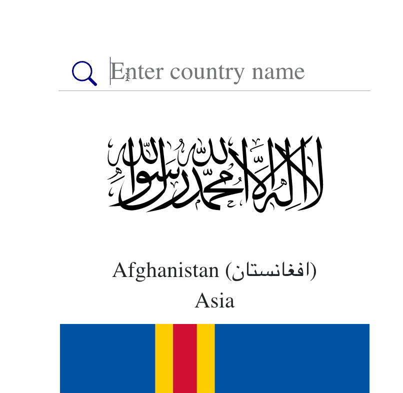

# Search for any flags from all over the world

> using public API_KEY = "https://restcountries.com/v2/all";

### TO BE done
- [x] [demo](https://search-flag.netlify.app/)
- [x] add better abstraction
- [x] write Unit tests based on (RTL) React Testing Library 
- [x] write E2E test with Cypress
- [x] CI integration with github Action 
- [ ] autocomplete search text field 
- [ ] pagination

